# Concept Map

This page is the review index for Ashiba concepts. Ashiba is a multi-package product, so the concept map is grouped by package responsibility instead of being a flat list.

The current ConceptSpec format is provisional. This page is optimized for human review in VitePress.

## Product Baseline

- Product: `Ashiba`
- Baseline: `rawsql-ts/packages/ztd-cli`
- CLI package target: `@ashiba/cli`
- CLI command: `ashiba`

## Package Responsibility Categories

| Category | Package area | Review purpose |
|---|---|---|
| Repository Philosophy | Repository-wide concepts and policies | Defines the product promise, runtime policy, SQL-first posture, and boundaries that every package must preserve. |
| CLI | `@ashiba/cli` | Owns user-facing commands, scaffolding workflows, generated review artifacts, and migration from `ztd-cli`. |
| Driver Packages | `@ashiba/sql-*`, `@ashiba/driver-adapter-*`, `@ashiba/testkit-adapter-*`, `@ashiba/dialect-*` | Own thin driver seams, named parameters, sort profiles, dialect details, and testkit/production adapter separation. |
| Extension Packages | `@ashiba/sql-transform-*`, future `@ashiba/extension-*` | Own future SQL-first transforms without becoming ORM query planning or a query DSL. |

## Repository Philosophy Concepts

These concepts apply to the whole repository and constrain all packages.

| ID | Display name | Status | Notes |
|---|---|---|---|
| `ashiba` | Ashiba | mostly done | Product identity for the `ztd-cli` rebrand; package and command surfaces now use Ashiba naming. Ashiba is not PostgreSQL-only; product-level vocabulary stays DBMS-neutral while DBMS-specific wrappers name their concrete driver or tool. Setup requires explicit DBMS starter selection and keeps package manager state application-owned. |
| `visible-sql` | Visible SQL | mostly done | SQL remains readable, reviewable, editable, executable, searchable, and uses named parameters for maintainability. |
| `boring-parts` | Boring Parts | mostly done | DTO definitions, mappers, query ID numbering, tests, migration review, sqlgrep, and impact analysis have initial Ashiba surfaces; richer row typing remains. |
| `ashiba-runtime-zero` | Ashiba Runtime Zero | mostly done | `@ashiba/cli` generates native TypeScript application code; generated application code does not require Ashiba CLI/runtime libraries, while driver adapters and extensions may have runtime dependencies. |
| `no-orm-runtime` | No ORM Runtime | mostly done | Rejects entities, relation loading, lazy loading, unit-of-work tracking, dirty tracking, and runtime model ownership; feature code owns orchestration. |
| `no-query-dsl-ceremony` | No Query DSL Ceremony | mostly done | SQL remains SQL, directly runnable in a SQL client, and free of Ashiba-only SQL notation. |
| `editable-generated-code` | Editable Generated Code | mostly done | Generated code remains visible repository code, may be edited by humans and AI agents, and stays under drift checks after generation. Generated-owned metadata and human-editable code must be physically separated. |
| `explicit-drift-recovery` | Explicit Drift Recovery | mostly done | Prefer clear drift failures with cause and next action over watch-mode automatic regeneration of schema/model artifacts. |
| `no-ai-behavior-file-distribution` | No AI Behavior File Distribution | mostly done | `ashiba init` may create README/docs, but Ashiba must not distribute `AGENTS.md`, `SKILL.md`, skills, prompts, or other files that alter AI-agent behavior. |
| `mapper-tested-type-safety` | Mapper-Tested Type Safety | mostly done | DTO and mapper type safety is guaranteed by mapper tests and DB-backed integration tests, not runtime result-row validation. |
| `error-output-modes` | Error Output Modes | mostly done | Shared formatter and CLI option support human-oriented and AI-oriented modes. Both modes include cause and next action/hint; known production errors in the current package set expose structured cause/action metadata, with formatter fallbacks kept as a safety net for unexpected errors. |
| `tooling-ast-dependency-policy` | Tooling AST Dependency Policy | partial | Ashiba tooling may depend on `rawsql-ts` core AST APIs through npm; development-only Runtime Zero support capabilities should be folded into `@ashiba/cli` unless a real non-CLI consumer exists. Dev-time SQL structural analysis should prefer tested AST APIs over regex/lexical parsing; remaining non-AST helpers are parser/AST capability debt unless limited to source offsets, generated TypeScript artifact extraction, or explicit diagnostics. Silent fallback is rejected. |
| `file-backed-runtime-sql` | File-Backed Runtime SQL | partial | Runtime execution boundaries accept reviewed SQL files or generated query source objects with SQL path and query model metadata, not arbitrary SQL string input. This applies to scaffolded/generated SQL clients and executors as well as driver adapter packages. The underlying driver still receives a string internally after metadata checks. |
| `query-model-metadata-contract` | Query Model Metadata Contract | partial | Runtime Zero SQL handling may use development-time AST analysis metadata only when the metadata is drift-checked against the source SQL by source hashes or equivalent checks. |
| `public-api-and-help-surface` | Public API and Help Surface | partial | Public exported functions require JSDoc. CLI commands require help surfaces before execution, with AI-oriented help allowed when a structured form is safer. |
| `cli-dry-run` | CLI Dry Run | partial | Mutating CLI commands must expose dry-run or equivalent preview behavior that reports planned effects without changing files or external state. Read-only inspection commands are already observational. |

## CLI Concepts

These concepts primarily belong to `@ashiba/cli`.

| ID | Display name | Status | Notes |
|---|---|---|---|
| `scaffolded-unit-tests` | Scaffolded Unit Tests | mostly done | Safety mechanism for Ashiba Runtime Zero development. |
| `test-lanes` | Test Lanes | mostly done | Supports traditional and Zero Table Dependency lanes through init, feature test scaffolds, generated mapping checks, and performance-lane helpers. |
| `performance-tuning-session` | Performance Tuning Session | mostly done | Traditional DB-backed tuning evidence: representative row counts, timeout status, plans, timings, sandbox-only candidate indexes, and explicit DDL promotion. |
| `drift-detection` | Drift Detection | mostly done | Checks DDL, SQL, DTO types, and mappers during development. |
| `migration-artifact` | Migration Artifact | mostly done | Review-oriented migration output, not hidden apply behavior. |
| `migration-query-generation` | Migration Query Generation | mostly done | CLI compares two DDL inputs and emits migration DDL plus risk info; DB connection and apply are out of scope. |
| `sql-impact-analysis` | SQL Impact Analysis | mostly done | Table usage, column usage, query outline, dependency graph, CTE slice debugging, and JSON output. |
| `sqlgrep` | sqlgrep | mostly done | Keep `sqlgrep` as the capability name; expose it through Ashiba query commands where useful. |
| `cli-no-hidden-sql-rewrite` | CLI No Hidden SQL Rewrite | mostly done | `@ashiba/cli` does not hide dynamic SQL rewriting in generated application code; driver adapters and SQL-first extensions keep their own explicit boundaries. |
| `rfba` | RFBA | mostly done | Review-First Boundary Architecture: scaffolding fixes repeatable VSA-style feature/query review grain, supports subgrouped boundaries, and avoids technical-layer folders as the primary split. |
| `query-boundary` | Query Boundary | mostly done | Feature-local named SQL access boundary for SQL, query ID, DTO/mapped result contract, parameter contract, execution contract, log trace identity, and verification. |
| `feature-boundary` | Feature Boundary | mostly done | Feature-owned public surface and query boundary container; one feature may contain multiple query boundaries as behavior grows. |

## Driver Package Concepts

These concepts belong to driver-neutral SQL libraries, production driver adapters, testkit adapters, and dialect packages.

| ID | Display name | Status | Notes |
|---|---|---|---|
| `thin-driver-adapter` | Thin Driver Adapter | mostly done | `pg` adapter owns named binding, parameter checks, query-model-gated safe sort, stale metadata rejection, and observer events while avoiding ORM and transaction ownership. Wrapper package names include the wrapped driver or tool name. |
| `named-parameter-binding` | Named Parameter Binding | mostly done | Source SQL uses named parameters such as `:name` or `@name`; DB driver wrappers compile them to driver placeholders. |
| `parameter-contract-check` | Parameter Contract Check | mostly done | Missing and unused parameters fail before execution in binder and PostgreSQL adapter paths. |
| `safe-sort-profile` | Safe Sort Profile | mostly done | DB driver wrapper-owned safe sort surface based on whitelisted profiles and CLI-generated query model metadata: source hash, root query shape, insertion position, order-by/comma mode, and sortable dictionary. Sort keys must exactly match the query model whitelist. |
| `optional-condition-compression` | Optional Condition Compression | partial | Explicit driver-owned SSSQL optional branch removal based on CLI-generated query model metadata. Runtime does not parse SQL, does not use Ashiba-only SQL markers, and rejects missing or stale metadata. |
| `logger-ready-execution-event` | Logger-Ready Execution Event | mostly done | Structured driver observer events cover start/end/error, masked params by default, optional unmasked params, query metadata, DB errors, and pre-execution validation failures. Scaffolded/generated SQL execution paths are also checked; low-level pool helpers are not enough when presented as the SQL client. |

## Transform Package Concepts

These concepts are extension capabilities outside the core `@ashiba/cli` Runtime Zero path. They may have runtime dependencies when needed. They should stay SQL-first and review-oriented, and must not redefine core `@ashiba/cli` as a hidden runtime SQL rewriter.

| ID | Display name | Status | Target package |
|---|---|---|---|
| `pipeline-expansion` | Pipeline Expansion | mostly done | Dev-time CTE structure, graph, slice, and plan support is folded into `@ashiba/cli` query commands because it supports Runtime Zero review and has no separate runtime consumer. |
| `scalar-expansion` | Scalar Expansion | deferred | Extension capability planned from `rawsql-ts` / `ztd-cli` SSSQL optional-condition tooling; deferred for the current pass. |

Future `@ashiba/extension-*` packages are reserved until a plugin mechanism exists.

## Category Relationship View

```mermaid
flowchart TD
  Repo["Repository Philosophy"]
  CLI["@ashiba/cli"]
  Drivers["Driver Packages"]
  Extensions["Transform Packages"]

  Repo --> CLI
  Repo --> Drivers
  Repo --> Extensions

  CLI --> FeatureBoundary["Feature Boundary"]
  FeatureBoundary --> RFBA["RFBA"]
  FeatureBoundary --> QueryBoundary["Query Boundary"]
  QueryBoundary --> NoHiddenRewrite["CLI No Hidden SQL Rewrite"]
  QueryBoundary --> MapperType
  CLI --> Tests["Scaffolded Unit Tests"]
  Tests --> TestLanes["Test Lanes"]
  Tests --> MapperType["Mapper-Tested Type Safety"]
  Tests --> Drift["Drift Detection"]
  Drift --> ExplicitDrift["Explicit Drift Recovery"]
  CLI --> Impact["SQL Impact Analysis"]
  Impact --> Sqlgrep["sqlgrep"]
  CLI --> NoHiddenRewrite["CLI No Hidden SQL Rewrite"]
  CLI --> Migration["Migration Artifact"]
  Migration --> MigrationQuery["Migration Query Generation"]

  Drivers --> ThinAdapter["Thin Driver Adapter"]
  ThinAdapter --> NamedParams["Named Parameter Binding"]
  ThinAdapter --> ParamCheck["Parameter Contract Check"]
  ThinAdapter --> FileBackedSql["File-Backed Runtime SQL"]
  ThinAdapter --> SafeSort["Safe Sort Profile"]
  ThinAdapter --> OptionalCompression["Optional Condition Compression"]
  ThinAdapter --> LoggerEvent["Logger-Ready Execution Event"]

  Extensions --> Pipeline["Pipeline Expansion"]
  Extensions --> Scalar["Scalar Expansion"]

  Repo --> VisibleSql["Visible SQL"]
  Repo --> RuntimeZero["Ashiba Runtime Zero"]
  Repo --> AstPolicy["Tooling AST Dependency Policy"]
  RuntimeZero --> NoOrm["No ORM Runtime"]
  Repo --> ErrorModes["Error Output Modes"]
  Repo --> PublicApiHelp["Public API and Help Surface"]
  Repo --> NoAgentFiles["No AI Behavior File Distribution"]
  Repo --> NoDsl["No Query DSL Ceremony"]
  RuntimeZero --> MapperType
  Pipeline --> VisibleSql
  Scalar --> VisibleSql
  NoHiddenRewrite --> SafeSort
  LoggerEvent --> ErrorModes
  AstPolicy --> Impact
  AstPolicy --> Sqlgrep
  NoAgentFiles --> ErrorModes
  PublicApiHelp --> ErrorModes
  FileBackedSql --> NamedParams
  FileBackedSql --> SafeSort
```

## Review Checks

- Repository-wide concepts must apply consistently to every package category.
- Visible SQL includes editability; scaffolded SQL and adjacent generated code must remain easy for humans and AI agents to change.
- Watch-mode automatic regeneration should not silently rewrite schema/model artifacts; drift should fail explicitly with cause and next action.
- `ashiba init` may create ordinary project documentation, but Ashiba must not distribute AI behavior files such as `AGENTS.md`, `SKILL.md`, skills, or prompts; AI guidance should come from visible scaffolds, contracts, and AI-oriented errors.
- Ashiba Runtime Zero applies to `@ashiba/cli` generated application code, not to every driver or extension package.
- Tooling AST dependencies, including `rawsql-ts` core, are allowed for Ashiba development packages and must not leak into generated application runtime code.
- Development-time capabilities that only support the Runtime Zero workflow should be integrated into `@ashiba/cli`; `sqlgrep` is the representative case.
- CLI concepts must cover practical ORM-like development support through scaffolding and checks, without implying an ORM runtime.
- RFBA must separate files by reviewable feature/query behavior using VSA-style boundaries, not by technical layers such as repository/service/model as the primary layout.
- Scaffolding must fix a repeatable review grain because review scope is subjective; prose concepts alone are not enough.
- A feature may contain multiple query boundaries, and `feature query scaffold` must support adding SQL behavior to an existing feature without forcing a new feature boundary.
- Feature boundaries may be subgrouped under the feature root; imports to shared seams or app-level test support should use root-stable aliases instead of depth-sensitive relative paths.
- Query boundaries should expose typed DTO/mapped result contracts to feature code and provide stable query IDs or names for debugging, drift checks, logs, performance evidence, and AI-oriented errors.
- Public exported functions must have JSDoc, and CLI commands must expose help before running mutating or expensive work.
- CLI help may be split into human-oriented and AI-oriented forms when that makes command contracts safer to consume.
- Core CLI scaffolding must not hide SQL transformation or dynamic SQL building inside generated application code; keep SQL visible and use driver/extension concepts for their bounded responsibilities.
- Driver package concepts must stay thin and must not own business SQL.
- Driver execution boundaries should not expose arbitrary SQL string input; use file-backed/generated query source objects and keep the final driver SQL string internal.
- Safe sort requests must exactly match query model whitelist keys; raw ORDER BY fragments and guessed column names are not accepted.
- Metadata that enables Runtime Zero SQL handling must be treated as part of the query contract, not a loose cache; stale metadata must fail before use.
- Optional condition compression must be explicit, metadata-backed, source-hash-checked, and free of Ashiba-only SQL markers.
- Transform package concepts must preserve visible SQL and must not become a query DSL.
- `Safe Sort Profile` is owned by the driver wrapper boundary; transform packages may define static schema or validation helpers only if that does not move ORDER BY rendering out of the driver wrapper or require Ashiba-only SQL notation.
